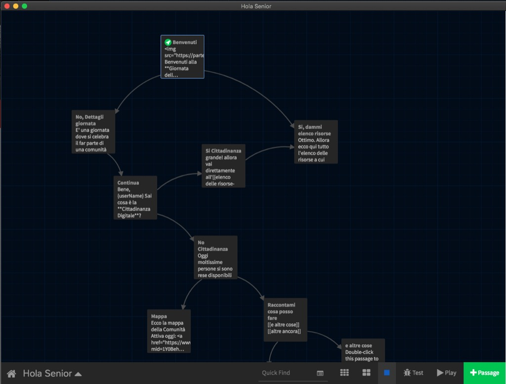
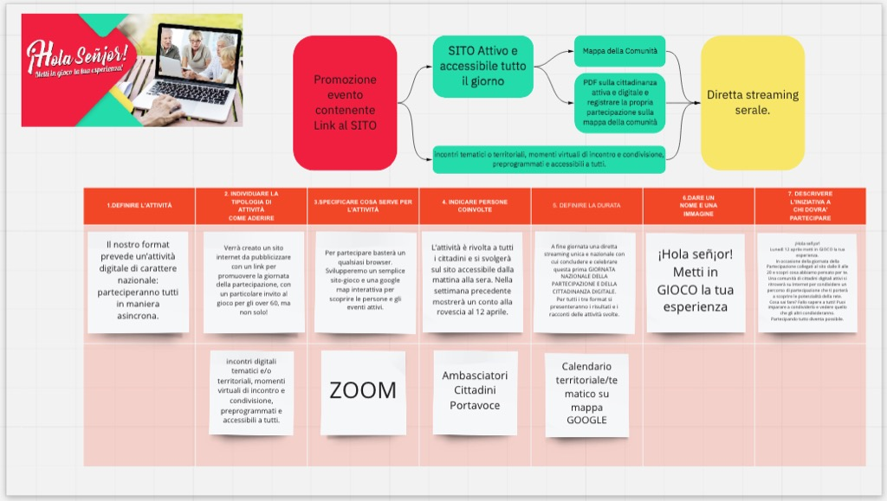

# Informazioni sul progetto Hola Senior

## Dominio web
abbiamo scelto partecipazione.xyz perché è semplice da ricordare (e costava solo .99 euro :) ovviamente il sito finale avrà un indirizzo ufficiale dell'Associazione.

## Il gioco
abbiamo realizzato il prototipo con Twine,
ma la versione finale dovrebbe essere realizzato in html più semplice, con un evento Google Analytics per ogni pagina, così da tracciare il comportamento di navigazione.

abbiamo iniziato a sperimentare con una versione Telegram Bot o un Chat Bot, ma per ora la versione sito è la più semplice per il nostro target

il game design del gioco sarebbe meglio che lo coordinasse qualcuno esperto in design narrativo e sappia fare sintesi.

## La Mappa della Comunità
una Google Map popolata da diversi database.
al momento abbiamo provato a iniettarvi
1. i dati dei portavoce eletti
2. 150 portavoce (generati casualmente)
3. 2000 partecipanti (generati casualmente)
4. qualche evento territoriale e tematico

i dati possono essere raccolti in Google Sheets oppure iniettati facilmente con del codice Javascript.

si possono fare ricerche territoriali.
ogni elemento può mostrare un popup multimediale, con foto, filmati, testo e links

## Eventi
la cosa più semplice è usare tutti Zoom e condividere gli indirizzi delle future conferenze. ma a nessuno vieta di usare altri canali o strumenti.

ovviamente nelle due settimane precedenti devono essere raccolte tutte le iniziative proposte dagli ambasciatori/attivisti (basta una semplice Google Form che verrà poi analizzata e validata dall'Associazione)

## Streaming serale
per l'evento serale conclusivo abbiamo pensato ad un servizio di streaming (youtube live / FB live) che è molto più accessibile rispetto ad uno zoom e supporta decine di migliaia di spettatori. ma nessuno vieta di usare Zoom se lo ritenete migliore.

## Risorse di progettazione

Questa è la tavola Miro con cui abbiamo lavorato:
[link a Miro](https://miro.com/app/board/o9J_lPYKZo0=/?moveToWidget=3074457356099431355&cot=14){:target="_blank"}

